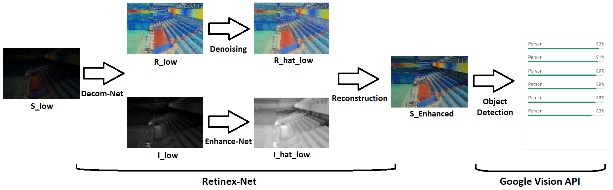

“This repository contains code and results for the Course Project by Deep Learning Spring 2020 course offered at Information Technology University, Lahore, Pakistan. This repository is only for learning purposes and is not intended to be used for commercial purposes.”

Course Link: http://im.itu.edu.pk/deep-learning-spring-2020/

## Note:
This project uses Deep Retinex-Net as a baseline project. For original code and paper, please refer to original github website "https://daooshee.github.io/BMVC2018website/". All the credit goes to the original authors. This project compiles all the code files into python notebook which can be easily opened by Google Collaboratory (https://colab.research.google.com).

# Object Detection in the Dark (using low-light image enhancement)
## Abstract
In the last decade, new state-of-the-art object detection models have emerged which not only classify images but can draw a bounding box around multiple objects of those classes. But very little attention is given to training models for low light images due to which these models cannot identify objects by directly looking at low light images. We propose a pipeline which consists of two steps: Low-Light Image Enhancement and Object Detection. For low-light image enhancement, an existing approach called Retinex-Net is used which is based on Retinex Theory. It trains a Deep Learning model with a dataset called LOL (LOw-Light Dataset). Low-Light Image is decomposed into Illumination and Reflectance map, Illumination is enhanced and merged back with the Reflectance to create bright light image. This image is then fed to an object detection model like SSD, YOLO or Google Vision API. Using this approach, model's detection accuracy improves significantly.

# Dataset
Please refer to the following Google Drive link for the dataset. Place the extracted folder in the root directory of the project.
https://drive.google.com/file/d/1eHoyHs-N1kajF_69WVb8OYQGVBbUUyoO/view?usp=sharing

Following are the few samples from LOL Dataset.

# Pipeline

# Results
On left are sample images taken from either web or captured using smartphone; On right are respective enhanced images.
Classification accuracy improves when compared side by side

